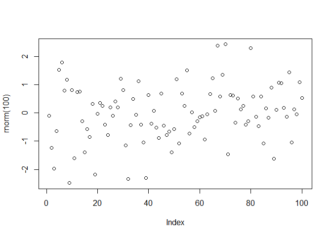
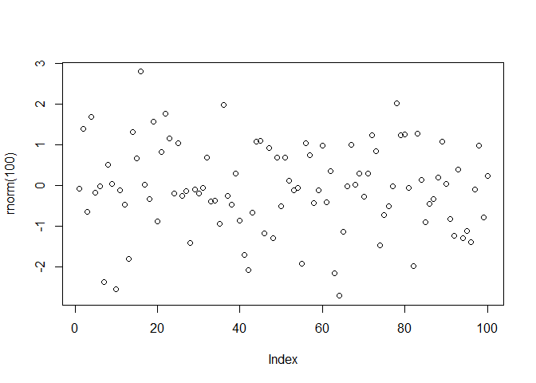
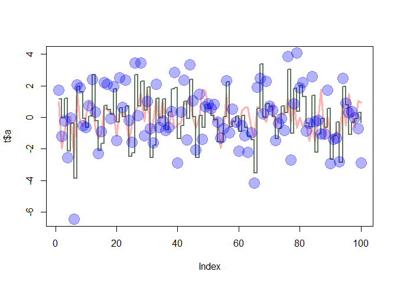
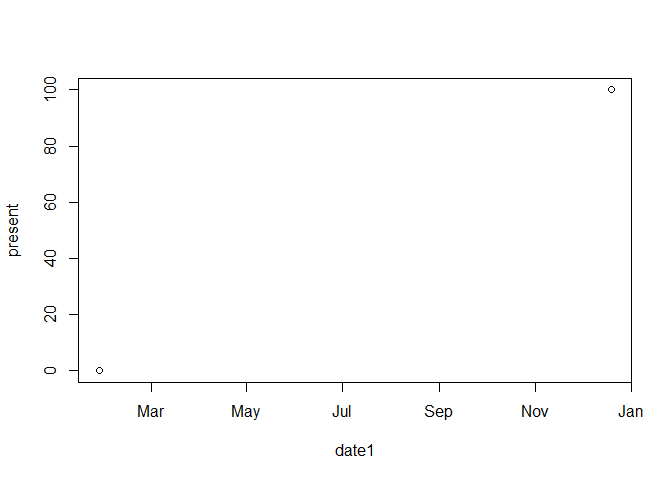

1.  ToDo : Compute the difference between 2014 and the year you started
    at this university and divide this by the difference between 2014
    and the year you were born. Multiply this with 100 to get the
    percentage of your life you have spent at this university. Use
    brackets if you need them.

<!-- -->

    ((2014-2013)/(2014-1992))*100

    ## [1] 4.545455

2.  ToDo: Repeat the previous ToDo, but with several steps in between.
    You can give the variables any name you want, but the name has to
    start with a letter.

<!-- -->

    a <- ((2014-2013)/(2014-1992))*100
    a

    ## [1] 4.545455

3.  ToDo: Compute the sum of 4, 5, 8 and 11 by first com- bining them
    into a vector and then using the function sum.

<!-- -->

    sum(c(4,5,8,11))

    ## [1] 28

4.  ToDo: Plot 100 normal random numbers.

<!-- -->

    plot(rnorm(100))

<!-- -->

5.  ToDo: Find help for the sqrt function

<!-- -->

    ?sqrt

    ## starting httpd help server ...

    ##  done

6.  ToDo: Make a file called firstscript.R containing R-code that
    generates 100 random numbers and plots them, and run this script
    several times.

<!-- -->

    file.create("firstscript.R")

    ## [1] TRUE

    "firstscript.R" <- plot(rnorm(100))

<!-- -->

7.  ToDo: Put the numbers 31 to 60 in a vector named P and in a matrix
    with 6 rows and 5 columns named Q. Tip: use the function seq. Look
    at the different ways scalars, vectors and matrices are denoted in
    the workspace window.

<!-- -->

    P <- c(seq(from=31,to=60,by=1))
    Q <- matrix(data=c(seq(from=31,to=60,by=1)),ncol=5,nrow=6)
    P

    ##  [1] 31 32 33 34 35 36 37 38 39 40 41 42 43 44 45 46 47 48 49 50 51 52 53
    ## [24] 54 55 56 57 58 59 60

    Q

    ##      [,1] [,2] [,3] [,4] [,5]
    ## [1,]   31   37   43   49   55
    ## [2,]   32   38   44   50   56
    ## [3,]   33   39   45   51   57
    ## [4,]   34   40   46   52   58
    ## [5,]   35   41   47   53   59
    ## [6,]   36   42   48   54   60

8.  ToDo: Make a script file which constructs three random normal
    vectors of length 100. Call these vectors x1,x2 and x3. Make a data
    frame called t with three columns (called a, b and c) containing
    respectively x1, x1+x2 and x1+x2+x3. Call the following functions
    for this data frame: plot(t) and sd(t). Can you understand the
    results? Rerun this script a few times.

<!-- -->

    x1<-c(rnorm(100))
    x2<-c(rnorm(100))
    x3<-c(rnorm(100))
    t <-data.frame(a<-x1,b<-x1+x2,c<-x1+x2+x3)
    plot(t)

<!-- -->

    sd(t$a+t$b+t$c)

    ## [1] 3.756759

9.  ToDo: Add these lines to the script file of the previous section.
    Try to find out, either by experimenting or by using the help, what
    the meaning is of rgb, the last argument of rgb, lwd, pch, cex.

<!-- -->

    plot(t$a, type="l", ylim=range(t),
    lwd=3, col=rgb(1,0,0,0.3))
    lines(t$b, type="s", lwd=2,
    col=rgb(0.3,0.4,0.3,0.9))
    points(t$c, pch=20, cex=4,
    col=rgb(0,0,1,0.3))

<!-- -->

RGB determines the amount of red, blue and green for a color in a plot

10.  ToDo: Make a file called tst1.txt in Notepad from the example in
    Figure 4 and store it in your working directory. Write a script to
    read it, to multiply the column called g by 5 and to store it as
    tst2.txt.

<!-- -->

    mtable=data.frame(g=c(3,4,5),a=c(12,43,54))
    write.table(mtable,file="tst1.txt")
    tbl=read.table(file="tst1.txt",header=TRUE)
    b=tbl$g*5
    write.table(b, file="tst2.txt")
    b

    ## [1] 15 20 25

11.  ToDo: Compute the mean of the square root of a vec- tor of 100
    random numbers. What happens?

<!-- -->

    mean(sqrt(c(rnorm(100))))

    ## Warning in sqrt(c(rnorm(100))): NaNs produced

    ## [1] NaN

12.  ToDo: Make a graph with on the x-axis: today, Sin-terklaas 2014 and
    your next birthday and on the y-axis the number of presents you
    expect on each of these days. Tip: make two vectors first.

<!-- -->

    date1=strptime(c("20160128","20161219"),format="%Y%m%d")
    present=c(0,100)
    date1

    ## [1] "2016-01-28 EST" "2016-12-19 EST"

    plot(date1,present)

<!-- -->

13.  ToDo: Make a vector from 1 to 100. Make a for-loop which runs
    through the whole vector. Multiply the elements which are smaller
    than 5 and larger than 90 with 10 and the other elements with 0.1

<!-- -->

    numrange = seq(from=1,to=100,by=1)
    s = c()
    for (i in 1:100)
    {
      if(numrange[i]<5)
      {
      s[i] = numrange[i]*10
      }
      else if(numrange[i]>90)
      {
      s[i] = numrange[i]*10
      }
      else
      {
        s[i]=numrange[i]*0.1
      }
    }
    s

    ##   [1]   10.0   20.0   30.0   40.0    0.5    0.6    0.7    0.8    0.9    1.0
    ##  [11]    1.1    1.2    1.3    1.4    1.5    1.6    1.7    1.8    1.9    2.0
    ##  [21]    2.1    2.2    2.3    2.4    2.5    2.6    2.7    2.8    2.9    3.0
    ##  [31]    3.1    3.2    3.3    3.4    3.5    3.6    3.7    3.8    3.9    4.0
    ##  [41]    4.1    4.2    4.3    4.4    4.5    4.6    4.7    4.8    4.9    5.0
    ##  [51]    5.1    5.2    5.3    5.4    5.5    5.6    5.7    5.8    5.9    6.0
    ##  [61]    6.1    6.2    6.3    6.4    6.5    6.6    6.7    6.8    6.9    7.0
    ##  [71]    7.1    7.2    7.3    7.4    7.5    7.6    7.7    7.8    7.9    8.0
    ##  [81]    8.1    8.2    8.3    8.4    8.5    8.6    8.7    8.8    8.9    9.0
    ##  [91]  910.0  920.0  930.0  940.0  950.0  960.0  970.0  980.0  990.0 1000.0

14.  ToDo: Write a function for the previous ToDo, so that you can feed
    it any vector you like (as argument). Use a for-loop in the function
    to do the computation with each element. Use the standard R function
    length in the specification of the counter

<!-- -->

    numfunc <- function(arg1,arg2)
    {
      numrange = c()
      arg1 <- arg1 -1
      i <- 0
      for (arg1 in arg1:arg2)
      {
        if (arg1 < 5 | arg1 > 90)
        {
          numrange[i] <- arg1 * 10
        }
        else
        {
          numrange[i] <- arg1 * 0.1
        }
        i <- i + 1
      }
      numrange
    }
    numfunc (arg1 = 1, arg2 = 100)

    ##   [1]   10.0   20.0   30.0   40.0    0.5    0.6    0.7    0.8    0.9    1.0
    ##  [11]    1.1    1.2    1.3    1.4    1.5    1.6    1.7    1.8    1.9    2.0
    ##  [21]    2.1    2.2    2.3    2.4    2.5    2.6    2.7    2.8    2.9    3.0
    ##  [31]    3.1    3.2    3.3    3.4    3.5    3.6    3.7    3.8    3.9    4.0
    ##  [41]    4.1    4.2    4.3    4.4    4.5    4.6    4.7    4.8    4.9    5.0
    ##  [51]    5.1    5.2    5.3    5.4    5.5    5.6    5.7    5.8    5.9    6.0
    ##  [61]    6.1    6.2    6.3    6.4    6.5    6.6    6.7    6.8    6.9    7.0
    ##  [71]    7.1    7.2    7.3    7.4    7.5    7.6    7.7    7.8    7.9    8.0
    ##  [81]    8.1    8.2    8.3    8.4    8.5    8.6    8.7    8.8    8.9    9.0
    ##  [91]  910.0  920.0  930.0  940.0  950.0  960.0  970.0  980.0  990.0 1000.0

15.  ToDo: Actually, people often use more for-loops than necessary. The
    ToDo above can be done more easily and quickly without a for-loop
    but with regular vector-computations.

<!-- -->

    numfunc <- function(arg1,arg2)
    {
      numrange = seq(from=arg1,to=arg2)
      i = c(numrange[numrange < 5] * 10, numrange[numrange > 4 & numrange < 91] * 0.1, numrange[numrange > 90] * 10)
      i
    }

    numfunc (arg1 = 2, arg2 = 110)

    ##   [1]   20.0   30.0   40.0    0.5    0.6    0.7    0.8    0.9    1.0    1.1
    ##  [11]    1.2    1.3    1.4    1.5    1.6    1.7    1.8    1.9    2.0    2.1
    ##  [21]    2.2    2.3    2.4    2.5    2.6    2.7    2.8    2.9    3.0    3.1
    ##  [31]    3.2    3.3    3.4    3.5    3.6    3.7    3.8    3.9    4.0    4.1
    ##  [41]    4.2    4.3    4.4    4.5    4.6    4.7    4.8    4.9    5.0    5.1
    ##  [51]    5.2    5.3    5.4    5.5    5.6    5.7    5.8    5.9    6.0    6.1
    ##  [61]    6.2    6.3    6.4    6.5    6.6    6.7    6.8    6.9    7.0    7.1
    ##  [71]    7.2    7.3    7.4    7.5    7.6    7.7    7.8    7.9    8.0    8.1
    ##  [81]    8.2    8.3    8.4    8.5    8.6    8.7    8.8    8.9    9.0  910.0
    ##  [91]  920.0  930.0  940.0  950.0  960.0  970.0  980.0  990.0 1000.0 1010.0
    ## [101] 1020.0 1030.0 1040.0 1050.0 1060.0 1070.0 1080.0 1090.0 1100.0
